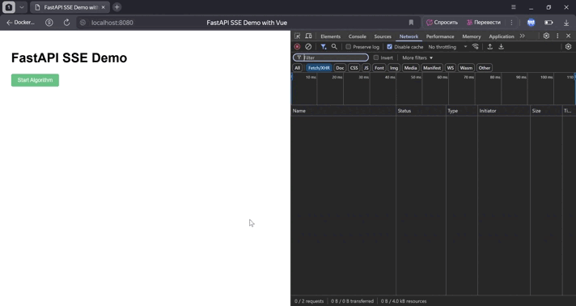
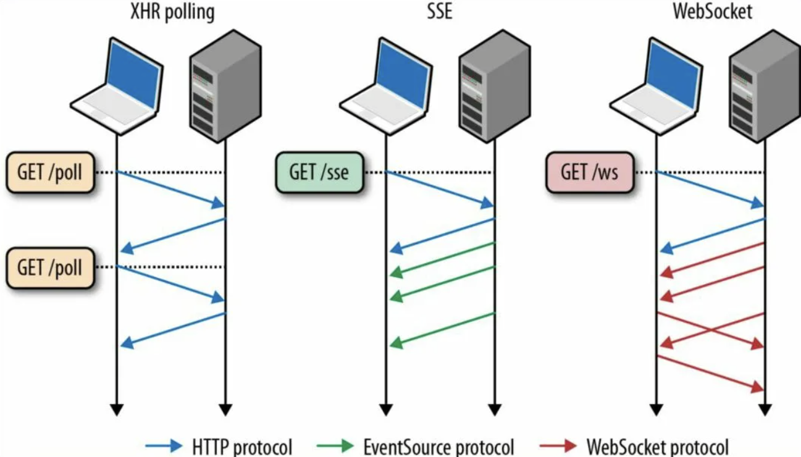

## Описание
Данный репозиторий содержит в себе исходный код, демонстрируйщий работу SSE(Server-Sent-Event) на FastAPI и Vue.js.

## Демонстрация

На GIF, продемонстрирована суть работы SSE 

## Введение
В современном веб-разработке существует множество подходов для реализации взаимодействия между клиентом и сервером в реальном времени. Одним из таких методов является Server-Sent Events (SSE) — технология, позволяющая серверу отправлять обновления клиенту по устойчивому соединению. Этот проект направлен на демонстрацию работы SSE, его особенностей и преимуществ по сравнению с традиционными методами, такими как polling и WebSocket.

## Что такое Server-Sent Events?
Server-Sent Events (SSE) — это стандарт, позволяющий серверу отправлять обновления клиенту через HTTP-соединение. В отличие от традиционного запроса/ответа, SSE обеспечивает одностороннюю связь от сервера к клиенту, что делает его идеальным выбором для приложений, требующих постоянного получения данных, таких как уведомления, обновления статуса или ленты новостей.

## Отличия от других технологий

### 1. Polling
Polling — это метод, при котором клиент периодически отправляет запросы на сервер для проверки наличия новых данных. Хотя этот подход прост в реализации, он может быть неэффективным: клиент генерирует множество запросов, даже когда данных нет, что приводит к ненужной нагрузке на сервер и увеличению задержек.
### 2. WebSocket
WebSocket — это протокол, обеспечивающий двустороннюю связь между клиентом и сервером. Он позволяет обмениваться данными в реальном времени и является отличным выбором для приложений с высоким уровнем интерактивности, таких как чаты или онлайн-игры. Однако WebSocket требует более сложной настройки и управления состоянием соединения.

## Преимущества SSE

1. Простота использования: SSE легко интегрируется в существующие веб-приложения с использованием стандартных HTTP-запросов.

2. Односторонняя связь: SSE оптимизирован для передачи данных от сервера к клиенту, что делает его идеальным для сценариев, где клиенту не требуется отправлять данные обратно на сервер.

3. Поддержка автоматического восстановления: Если соединение прерывается, браузер автоматически восстанавливает его без необходимости дополнительной логики на стороне клиента.

4. Низкие накладные расходы: SSE использует стандартный HTTP-протокол, что позволяет избежать дополнительных затрат на установку и управление соединениями.

## Установка
1. Склонирйте репозиторий в нужную директорию командой - `git clone https://github.com/ddavydovv/sse.git`, или другими альтернативными методами;
2. Переименуйте файл .env.example в .env;
3. Первым делом, находясь в корневой директории проекта, запустите команду - `docker compose up -d --build`, убедившись, что десктоп приложение Docker запущено на вашем компьютере. Дождитесь завершения развертывания;
4. Проверьте, что все запущенные контейнеры отрабатывают корректно и не выдают ошибок;
5. Перейдите по url `http://localhost:8080/` и пробуйте!)
